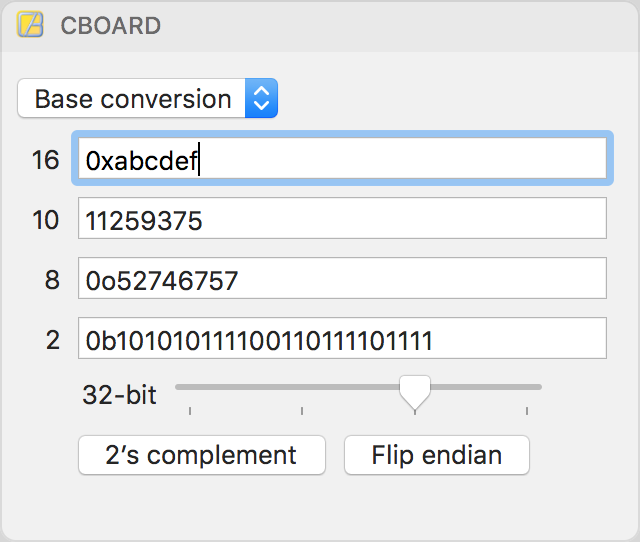
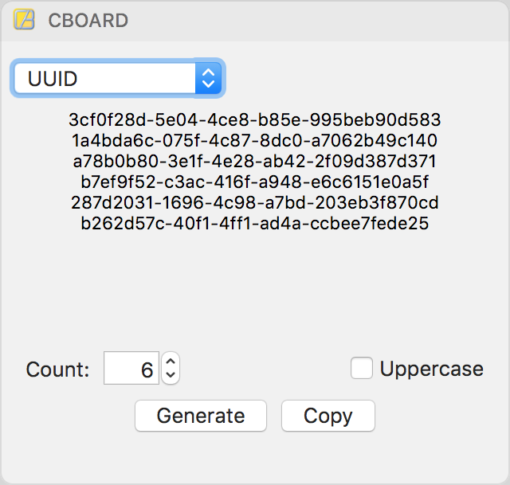

 CBoard
==========================================================================

**CBoard** is macOS notification center widget to perform quick
programming-related tasks.

Current it supports the following features:

| Feature         | Screenshot                                       |
|-----------------|--------------------------------------------------|
| Base conversion |  |
| UUID generation |            |

How to build
------------

1. **Requirements**: macOS Sierra (10.12), Xcode 8.
2. Clone this repository.
3. Open `XcodeProject/CBoard.xcodeproj`
4. Build.
